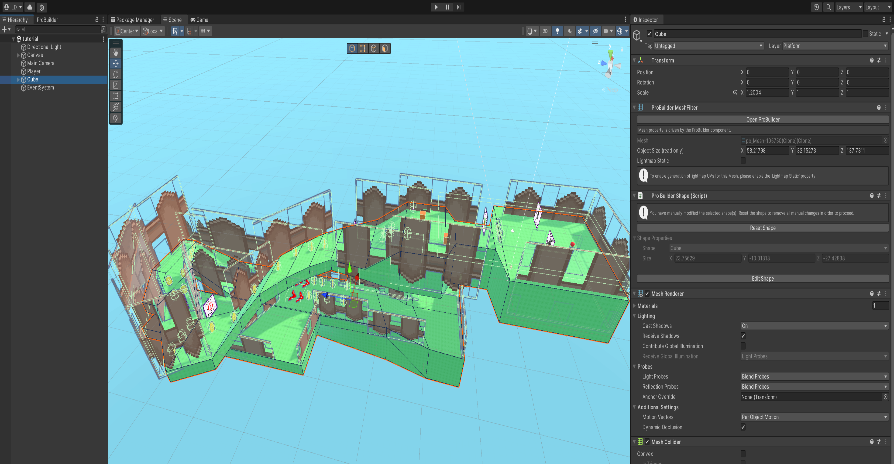

# [PLATFORMER BASED GAME]

[Fundamentals in Game Development]

[Joshua Bellas]

[2326296]

## Research

## Various features I ended up looking into for this particular project

- [Unity physics based transform](https://docs.unity3d.com/ScriptReference/Transform.html)
- [Unity mathf clamp](https://docs.unity3d.com/6000.0/Documentation/ScriptReference/Mathf.Clamp.html)
- [Unity Vector 3](https://docs.unity3d.com/ScriptReference/Vector3.html)
- [Unity Euler Angles](https://docs.unity3d.com/ScriptReference/Transform-eulerAngles.html)


```markdown
Early on in the project's development I knew that I would want to draw inspiration from the 'Super Monkey Ball' franchise that focuses on puzzle platformer styles of gameplay by forcing you to rotate a stage to move a ball. I felt like this was a unique take on the platformer genre and thus wanted to take inspiration and implement this core system into my project, hence the research into object transformation.
```

## Implementation

```markdown
When it came to the implementation of my ideas my general thought process and aims for the project was to create a unique take on the platformer genre as previously mentioned. To do this I decided to take an unconventional method to controls to create a fresh user experience that is not commonly explored.
```
<br>

```csharp
 private Rigidbody rb;

 [SerializeField] private float speed;
 [SerializeField]private Vector3 currentValue;

 private Transform playerTransform;

 private float moveHorizontal;
 private float moveVertical;

 private void Start()
 {
    rb = gameObject.GetComponent<Rigidbody>();
    playerTransform = gameObject.transform;
 }
```
*Figure 1. The initialisation of the level's movement script*

```csharp
private void FixedUpdate()
{
    moveHorizontal = Input.GetAxis("Horizontal") * speed;
    moveVertical = Input.GetAxis("Vertical") * speed;

    Vector3 moveForward = new Vector3(moveVertical * Time.deltaTime, 0, moveHorizontal * Time.deltaTime);
    rb.MovePosition(rb.position + moveForward);


    CheckValue();  
    Quaternion deltaRotation = Quaternion.Euler(moveVertical, 0f , moveHorizontal);  // Rotation around the Y-axis
    rb.MoveRotation(rb.rotation * deltaRotation);
 
}

private void CheckValue()
{
    if ((playerTransform.eulerAngles.x < 325 && playerTransform.eulerAngles.x > 40) && moveVertical < 0)
    {
        moveVertical = 0;
    }
    if ((playerTransform.eulerAngles.x > 35f && playerTransform.eulerAngles.x < 39f) && moveVertical > 0)
    {
        moveVertical = 0;
    }

    if((playerTransform.eulerAngles.z < 325 && playerTransform.eulerAngles.z > 40) && moveHorizontal < 0)
    {
        moveHorizontal = 0;
    }
    else if((playerTransform.eulerAngles.z > 35f && playerTransform.eulerAngles.z < 39f) && moveHorizontal > 0)
    {
        moveHorizontal = 0;
    }
}
```
*Figure 2. Fixed update and general level movement handling*

```markdown
As seen in figure 1, I started off by serialising fields so that I could adjust the speed at which the level would rotate in order to adequately test what speeds felt the best to control during gameplay, I also initalise a rigidbody, as the level uses physics based movement, attaching and referencing said rigidbody is essential to apply transformations to the level. Then using euler angles I was able to limit the angles that the level was able to rotate at, this was done in order to prevent the player from completely flipping the stage in any given direction.
```

### Creative choices and its outcomes

- As mentioned previously, the choice to make the player rotate the stage instead of moving the ball in the level is one of the larger creative decisions I had made when deciding on the direction of the project.
- Though different and creative, it posed many challenges when initially trying to get the stage's rotation mechanics to work as intended.


<br>


*Figure 3. The aforementioned stage and it's children objects that allow the rotation functions to work*

### Technical issues

- For a large majority of the development, the physics were not functioning as ideally as they should've been with the physics feeling floaty and generally unappealing to control due to the ball not sticking on the ground.
- When initially attempting to use a non-physics based movement system for the stage, a large amount of clipping issues cropped up due to the fact that the stage was not dynamically moving in real time and thus the ball was unable to properly be affected by the stage's rotation.

### Fixing technical issues

```csharp
public class ClampVelocity : MonoBehaviour
{
    [Range(-1000000f, 0f)] public float downwardForce = -500000f;
    private Rigidbody _rb;

    private void Start() => _rb = GetComponent<Rigidbody>();

    private void FixedUpdate()
    {
        _rb.AddForce(0f, downwardForce, 0f);
    }

}
```
*Figure 4. Fixing the issues with the ball not sticking to the ground and staying on the stage*

- Refer to *Figure 1* for my fix for getting the stage's clipping issues by switching it to physics based movement.

### Finishing off a few additional features

```markdown
To finish off and make the game feel like a complete package I implemented a few smaller features required by the task outline and implemented them into the project.
```

```csharp

```

## Outcome

Here are a variety of links that lead to the game's gameplay being demonstrated, alongside a link to view the github repository online and download the current build of the game for yourself through Itch.io

- [Gameplay in action](https://youtu.be/DmvX_e9-Br4)
- [Github repository link](https://lunavia.itch.io/ball-roll-tech-demo)
- [Game demo on Itch.io](https://lunavia.itch.io/ball-roll-tech-demo)


## Critical Reflection

### What did or did not work well and why?

```markdown
Looking back on the completed work and the finished product for the ball project, I feel the strongest part of the project was its concept in general and the way it was executed in practice. The concept of using the stage to move the ball is a loop that could definitely be expanded upon by adding various other features and has a lot of room for improvement.

On the other hand, I feel there is a lot to be desired, specifically the way in which the controls feel in execution and how they can be quite slippery and feel unintuitive if you don't immediately gain an affinity for the control scheme.

The one level I did end up creating was also fairly basic in terms of what it had on display and what actual gameplay was on offer, this can easily be fixed through just blocking out and creating more levels if I were to reapproach this product.
```

### What would you do differently next time?

```markdown
If I were to revisit the project I would definitely look a bit more into the physics based movement that unity has to offer and see if there any other alternatives or methods to create smoother controls, the current implemented methods can feel a bit unintuitive at points due to their rudimentary nature.

I think I would also go back and add sound effects and audio functionality into the game where possibe just to give the game a bit more personality and style to overall enhance the experience for the user.

Ultimately I would also just create more levels to add more replayability to the game and give a bit more content.
```

## Bibliography

https://docs.unity3d.com/ScriptReference/Transform-eulerAngles.html
https://docs.unity3d.com/ScriptReference/Vector3.html
https://docs.unity3d.com/6000.0/Documentation/ScriptReference/Mathf.Clamp.html
https://docs.unity3d.com/ScriptReference/Transform.html

## Declared Assets
```markdown
I created all assets myself or used Unity's built in colour material system.
```
